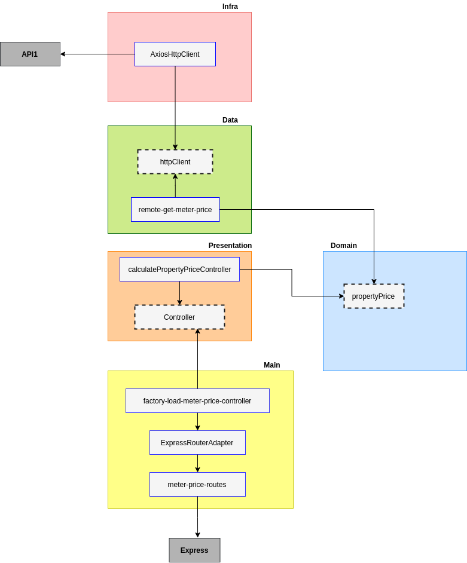

# In-gaia-backend-challenge-**API2**

## API2

Essa api faz parte do desafio backend da empresa [In-Gaia](https://github.com/ingaia/backend-challenge)

O objetivo dessa api é calcular e servir ao usuário o valor/preço do imóvel.

## Apis contidas nesse repositório

[calculate-property-price](./requirements/calculate-property-price.md)

## Tecnologias utilizadas

  - Typescript
  - NodeJS
  - Jest
  - Supertest
  - Express
  - Heroku

## Teste de unidade e testes de integração

A API2 utiliza as seguintes ferramentas para testes

  - Jest: framework de teste
  - supertest: utilizado nos testes de integração, nas rotas http

Executar testes: 

  - **npm run test:unit**
    - Executa os testes unitários

  - **npm run test:integration**
    - Executa os testes de integração

  - **npm run test:ci**
    - Executa os testes de unidade, testes de integração e cobertura de testes

## Instalação e execução da API2

Comandos para instalar e inicializar

 - **npm install**
   - Instala as dependências da api no seu computador
 
 - **npm run up**
   - Executa a api baseado em uma imagem do node 14.x (ver especificação da engine no package.json)
   - Cria um container para a aplicação com o nome **in-gaia-teste-api1-container**
  
Comandos para finalizar a execução

  - **npm run stop**
    - Para a execução do container **in-gaia-teste-api2-container**, portanto, desliga a aplicação API1

## Postman

O Postman pode ser utilizado para consumir a api em ambiente local e de produção.

[Collections e environments](./postman)

## Construção da aplicação

A construção da api2 foi feita por camadas, conforme o diagrama abaixo: 

**Leitura do diagrama**

 - A: Camada **presentation**
    - Depende da camada de domínio.
    - Esta camada executa um ou mais casos de uso.
    - Ocorre a validação dos dados recebidos pela requisição http, para garantir a execução do caso de uso.
    - Esta camada implementa a regra de negócio de que a quantidade de metros quadrados deve estar entre 10 e 10000

 - B: Camada **domain**
    - Esta camada não depende de nenhuma outra camada da aplicação.
    - Define o model __property-price__ e __meter-price__
    - Implementa uma função que calcula o valor do imóvel
      - Parâmetros dessa função:
        - Quantidade de metros quadrados
        - Preço do metro quadrado
      - Retorno dessa função
        - O valor do imóvel.
  
 - C: Camada **data**
    - Esta camada depende das fontes de dados da aplicação.
    - Coordena os dados vindos de diferentes fontes de dados.
    - API1 tem uma fonte de dados, a API1.
    - Esta camada utiliza um cliente http para consumir a API1.
     
 - D: Camada **infra**
    - Esta camada conhece bibliotecas externas, no caso, o cliente http - Axios.
    - Esta camada implementa os repositórios das fontes de dados, no caso, o Axios.
    - Outras bibliotecas, como por exemplo MongoDb, poderiam ficar nessa camada.
  
 - E: Camada **main**
    - Esta camada depende da camada de apresentação.
    - O servidor web(Express) e as rotas são configurados nessa camada.
    - Esta camada implementa recursos necessários para que as rotas http funcionem.

## Próximos passos

 - Adicionar Swagger ao projeto
 - Processos de CI/CD no Heroku